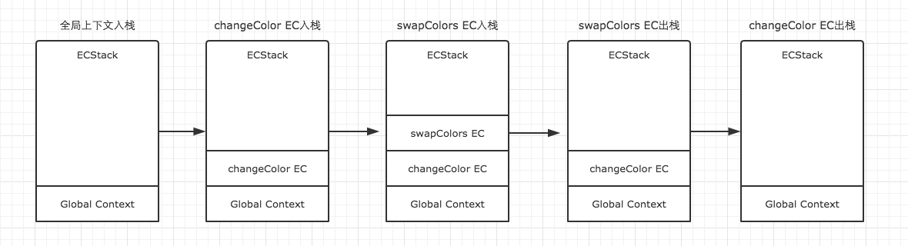
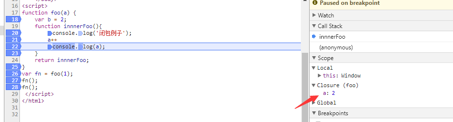

>  JavaScript代码的整个执行过程，分为两个阶段，代码解释阶段与代码执行阶段。解释阶段将代码转换成可执行代码，这个阶段**作用域规则**会确定。执行阶段由JS**引擎**完成，主要任务是执行代码，执行上下文在这个阶段创建。

#### JS执行上下文

当执行 JS 代码时，会产生三种执行上下文

- 全局执行上下文：开始执行的时候就进入了全局上下文。
- 函数执行上下文：当调用一个函数时（激活），一个新的执行上下文被创建。
- eval 执行上下文（几乎不用）

JS会以栈的方式来执行，栈底永远是全局上下文，栈顶就是当前正在执行的上下文。如下：

```js
var color = 'blue';
function changeColor() {
    var anotherColor = 'red';
    function swapColors() {
        var tempColor = anotherColor;
        anotherColor = color;
        color = tempColor;
    }
    swapColors();
}
changeColor();
```



**执行上下文特点**

- 单线程
- 同步执行，只有栈顶的上下文处于执行中，其他上下文需要等待
- 全局上下文只有唯一的一个，它在浏览器关闭时出栈
- 函数的执行上下文的个数没有限制
- 每次某个函数被调用，就会有个新的执行上下文为其创建，即使是调用的自身函数，也是如此。

#### 上下文创建

**1 创建阶段：**在这个阶段中，执行上下文会分别**创建变量对象**，建立**作用域链**（作用域链，是由当前环境与上层环境的一系列变量对象组成，它保证了当前执行环境对符合访问权限的变量和函数的有序访问），以及**确定this的指向**。

**2 代码执行阶段：**创建完成之后，就会开始执行代码，这个时候，会完成变量赋值，函数引用，以及执行其他代码。

##### 变量对象创建

JS 解释器会找出需要提升的变量和函数，并且给他们提前在内存中开辟好空间，函数的话会将整个函数存入内存中，变量只声明并且赋值为 undefined，相同的函数会覆盖上一个函数，并且函数优先于变量提升

3  检查当前上下文中的**变量声明**，赋值为undefined。如果该变量名的属性已经存在，为了防止和函数重名，覆盖掉函数则直接跳过。function声明会比var声明优先级更高一点。

```js
console.log(a);
var a =2;
console.log(a);
function test() {
  console.log(a); //变量对象，未执行，不能访问，下同
  console.log(foo());
  var a = 1; //从执行开始变成活动对象
  function foo() {
      var b = 2;
     return b;
  }
}
test();
```

##### 执行过程：

```js
// 首先进入全局上下文，栈内： 全局栈
window = {
    VO: { // 函数和var变量声明
       a:undefined,
       test:ƒ test()
    },// 变量对象 
    scopeChain: {VO(global)},//作用域链  
    this: Window
}

// 然后当执行到test();的时候，进入test的上下文：栈内： 全局栈 test

test = {
 VO: {
        a:undefined,
        foo: f foo()
  },// 变量对象 
  scopeChain:  {VO(test), VO(global)},//作用域链  
  this: {window}
}

// 然后当执行到foo();的时候，进入foo的上下文： 栈内： 全局栈 test foo

foo = {
  VO: {
     b:undefined,
  },// 变量对象 
  scopeChain: {VO(foo)，VO(test), VO(global)},//作用域链   
  this: {window}
}
// 作用域链是由一系列变量对象组成，我们可以在这个单向通道中，查询变量对象中的标识符，这样就可以访问到上一层作用域中的变量了。
//foo出栈，test出栈 全局出栈
```


### 闭包

**闭包形成的条件**：1 函数套函数  2 子函数访问了父函数的变量对象。[没访问就没有必要，可在谷歌浏览器测试]

**闭包的特点**： 被访问的父函数的变量，在父函数出栈后，不会被销毁，可以继续被子函数访问。

```js
function foo(a) {
    function innnerFoo(){
        console.log(333);
        console.log(a);
    }
    return innnerFoo;
}
var fn = foo(1);
fn();
```




**如图： **

1 执行fn(); fn进栈，返回innerfoo函数，然后出栈，innerfoo函数进栈，此时形成闭包，闭包变量为a，执行a++, a变为2

2 再次执行fn()，innerfoo函数再次进栈，执行a++,a变成3，在上一步的基础上加的。

**由此可知，第一步fn已经出栈了，变量对象已经销毁，但是被访问到的闭包a,并没有被销毁。可以被继续fn访问。**

#### 闭包使用场景：

##### 1 延迟函数setTimeout

```js
function fn() {
    console.log('this is test.')
}
var timer =  setTimeout(fn, 1000);id 立即就产生了
console.log(timer);  // 1   this is test

/ * 执行上面的代码，变量timer的值，会立即输出出来，表示setTimeout这个函数本身已经执行完毕了。但是一秒钟之后，fn才会被执行。这是为什么？

按道理来说，既然fn被作为参数传入了setTimeout中，那么fn将会被保存在setTimeout变量对象中，setTimeout执行完毕之后，它的变量对象也就不存在了。可是事实上并不是这样。至少在这一秒钟的事件里，它仍然是存在的。这正是因为闭包。
很显然，这是在函数的内部实现中，setTimeout通过特殊的方式，保留了fn的引用，让setTimeout的变量对象，并没有在其执行完毕后被垃圾收集器回收。因此setTimeout执行结束后一秒，我们任然能够执行fn函数 
```

##### 2  模块化，创建私有作用域，将代码放在立即执行函数中，通过返回另一个函数暴露可访问的参数，没暴露的外界无法访问。

##### 3  一列button，点击弹出对应索引的时候：在点击监听事件的外层创建立即执行函数，将索引传进去。


##### 闭包可能带来的问题：

使用闭包的同时比较容易形成循环引用，如果闭包的作用域链中保存着一些 DOM 节点，这时候就有可能造成内存泄露。
如果要解决循环引用带来的内存泄露问题，我们只需要把循环引用中的变量设为 null即可。

##### 经典面试题，循环中使用闭包解决 `var` 定义函数的问题

```js
for ( var i=1; i<=5; i++) {
	setTimeout( function timer() {
		console.log( i );
	}, i*1000 );
}
// 6 6 6 6 6

// 第一种使用闭包
for (var i = 1; i <= 5; i++) {
  (function(j) {
    setTimeout(function timer() {
      console.log(j);
    }, j * 1000);
  })(i);
}

// 第二种就是使用 setTimeout 的第三个参数
for ( var i=1; i<=5; i++) {
	setTimeout( function timer(j) {
		console.log( j );
	}, i*1000, i);
}

// 第三种就是使用 let 定义 i 了
for ( let i=1; i<=5; i++) {
	setTimeout( function timer() {
		console.log( i );
	}, i*1000 );
}
```
