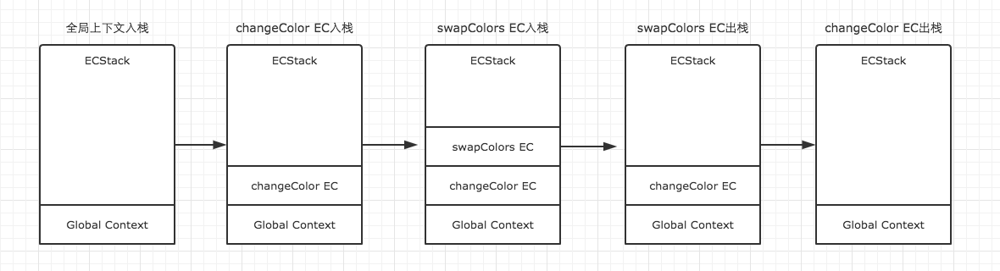
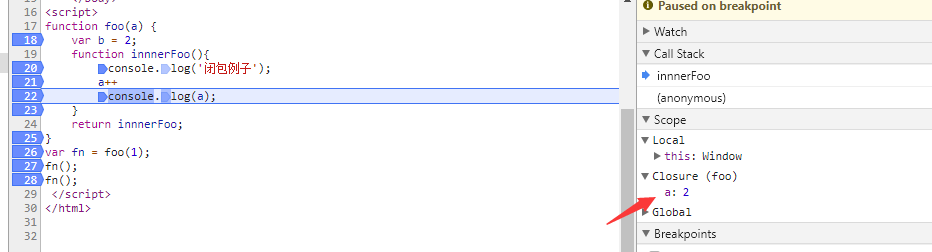
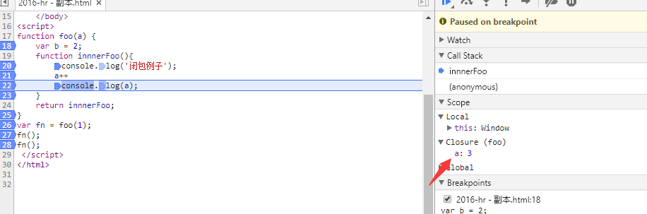

>  JavaScript代码的整个执行过程，分为两个阶段，代码解释阶段与代码执行阶段。解释阶段将代码转换成可执行代码，这个阶段**作用域规则**会确定。执行阶段由JS**引擎**完成，主要任务是执行代码，执行上下文在这个阶段创建。

#### JS执行上下文

当执行 JS 代码时，会产生三种执行上下文

- 全局执行上下文：开始执行的时候就进入了全局上下文。
- 函数执行上下文：当调用一个函数时（激活），一个新的执行上下文被创建。
- eval 执行上下文（几乎不用）

JS会以栈的方式来执行，栈底永远是全局上下文，栈顶就是当前正在执行的上下文。如下：

```js
var color = 'blue';
function changeColor() {
    var anotherColor = 'red';
    function swapColors() {
        var tempColor = anotherColor;
        anotherColor = color;
        color = tempColor;
    }
    swapColors();
}
changeColor();
```



**执行上下文特点**

- 单线程
- 同步执行，只有栈顶的上下文处于执行中，其他上下文需要等待
- 全局上下文只有唯一的一个，它在浏览器关闭时出栈
- 函数的执行上下文的个数没有限制
- 每次某个函数被调用，就会有个新的执行上下文为其创建，即使是调用的自身函数，也是如此。

#### 上下文创建

**1 创建阶段：**在这个阶段中，执行上下文会分别**创建变量对象**，建立**作用域链**（作用域链，是由当前环境与上层环境的一系列变量对象组成，它保证了当前执行环境对符合访问权限的变量和函数的有序访问），以及**确定this的指向**。

**2 代码执行阶段：**创建完成之后，就会开始执行代码，这个时候，会完成变量赋值，函数引用，以及执行其他代码。

##### 变量对象创建

JS 解释器会找出需要提升的变量和函数，并且给他们提前在内存中开辟好空间，函数的话会将整个函数存入内存中，变量只声明并且赋值为 undefined，相同的函数会覆盖上一个函数，并且函数优先于变量提升

3  检查当前上下文中的**变量声明**，赋值为undefined。如果该变量名的属性已经存在，为了防止和函数重名，覆盖掉函数则直接跳过。function声明会比var声明优先级更高一点。

```js
console.log(a);
var a =2;
console.log(a);
function test() {
  console.log(a); //变量对象，未执行，不能访问，下同
  console.log(foo());
  var a = 1; //从执行开始变成活动对象
  function foo() {
      var b = 2;
     return b;
  }
}
test();
```

##### 执行过程：

```js
// 首先进入全局上下文，栈内： 全局栈
window = {
    VO: { // 函数和var变量声明
       a:undefined,
       test:ƒ test()
    },// 变量对象 
    scopeChain: {VO(global)},//作用域链  
    this: Window
}

// 然后当执行到test();的时候，进入test的上下文：栈内： 全局栈 test

test = {
 VO: {
        a:undefined,
        foo: f foo()
  },// 变量对象 
  scopeChain:  {VO(test), VO(global)},//作用域链  
  this: {window}
}

// 然后当执行到foo();的时候，进入foo的上下文： 栈内： 全局栈 test foo

foo = {
  VO: {
     b:undefined,
  },// 变量对象 
  scopeChain: {VO(foo)，VO(test), VO(global)},//作用域链   
  this: {window}
}
// 作用域链是由一系列变量对象组成，我们可以在这个单向通道中，查询变量对象中的标识符，这样就可以访问到上一层作用域中的变量了。
//foo出栈，test出栈 全局出栈
```


### 闭包

**闭包形成的条件**：1 函数套函数  2 子函数访问了父函数的变量对象。[没访问就没有必要，可在谷歌浏览器测试]

**闭包的特点**： 被访问的父函数的变量，在父函数出栈后，不会被销毁，可以继续被子函数访问。

```js
function foo(a) {
    function innnerFoo(){
        console.log(333);
        console.log(a);
    }
    return innnerFoo;
}
var fn = foo(1);
fn();
```





**如图： **

1 执行fn(); fn进栈，返回innerfoo函数，然后出栈，innerfoo函数进栈，此时形成闭包，闭包变量为a，执行a++, a变为2

2 再次执行fn()，innerfoo函数再次进栈，执行a++,a变成3，在上一步的基础上加的。

**由此可知，第一步fn已经出栈了，变量对象已经销毁，但是被访问到的闭包a,并没有被销毁。可以被继续fn访问。**

#### 闭包使用场景：

##### 1 延迟函数setTimeout

```js
function fn() {
    console.log('this is test.')
}
var timer =  setTimeout(fn, 1000);id 立即就产生了
console.log(timer);  // 1   this is test

/ * 执行上面的代码，变量timer的值，会立即输出出来，表示setTimeout这个函数本身已经执行完毕了。但是一秒钟之后，fn才会被执行。这是为什么？

按道理来说，既然fn被作为参数传入了setTimeout中，那么fn将会被保存在setTimeout变量对象中，setTimeout执行完毕之后，它的变量对象也就不存在了。可是事实上并不是这样。至少在这一秒钟的事件里，它仍然是存在的。这正是因为闭包。
很显然，这是在函数的内部实现中，setTimeout通过特殊的方式，保留了fn的引用，让setTimeout的变量对象，并没有在其执行完毕后被垃圾收集器回收。因此setTimeout执行结束后一秒，我们任然能够执行fn函数 
```

##### 2  模块化，创建私有作用域，将代码放在立即执行函数中，通过返回另一个函数暴露可访问的参数，没暴露的外界无法访问。

##### 3  一列button，点击弹出对应索引的时候：在点击监听事件的外层创建立即执行函数，将索引传进去。


##### 闭包可能带来的问题：

使用闭包的同时比较容易形成循环引用，如果闭包的作用域链中保存着一些 DOM 节点，这时候就有可能造成内存泄露。
如果要解决循环引用带来的内存泄露问题，我们只需要把循环引用中的变量设为 null即可。

##### 经典面试题，循环中使用闭包解决 `var` 定义函数的问题

```js
for ( var i=1; i<=5; i++) {
	setTimeout( function timer() {
		console.log( i );
	}, i*1000 );
}
// 6 6 6 6 6

// 第一种使用闭包
for (var i = 1; i <= 5; i++) {
  (function(j) {
    setTimeout(function timer() {
      console.log(j);
    }, j * 1000);
  })(i);
}

// 第二种就是使用 setTimeout 的第三个参数
for ( var i=1; i<=5; i++) {
	setTimeout( function timer(j) {
		console.log( j );
	}, i*1000, i);
}

// 第三种就是使用 let 定义 i 了
for ( let i=1; i<=5; i++) {
	setTimeout( function timer() {
		console.log( i );
	}, i*1000 );
}
```

## call, apply, bind 区别

`call` 和 `apply` 都是为了解决改变 `this` 的指向。作用都是相同的，只是传参的方式不同。

除了第一个参数外，`call` 可以接收一个参数列表，`apply` 只接受一个参数数组。

```js
let a = {
    value: 1
}
function getValue(name, age) {
    console.log(name)
    console.log(age)
    console.log(this.value)
}
getValue.call(a, 'yck', '24')
getValue.apply(a, ['yck', '24'])
```


## 手写 call、apply 及 bind 函数

```!
涉及面试题：call、apply 及 bind 函数内部实现是怎么样的？
```

首先从以下几点来考虑如何实现这几个函数

- 不传入第一个参数，那么上下文默认为 `window`
- 改变了 `this` 指向，让新的对象可以执行该函数，并能接受参数

那么我们先来实现 `call`

```js
Function.prototype.myCall = function(context) {
  if (typeof this !== 'function') {
    throw new TypeError('Error')
  }
  context = context || window
  context.fn = this
  const args = [...arguments].slice(1)
  const result = context.fn(...args)
  delete context.fn
  return result
}
```

以下是对实现的分析：

- 首先 `context` 为可选参数，如果不传的话默认上下文为 `window`
- 接下来给 `context` 创建一个 `fn` 属性，并将值设置为需要调用的函数
- 因为 `call` 可以传入多个参数作为调用函数的参数，所以需要将参数剥离出来
- 然后调用函数并将对象上的函数删除

以上就是实现 `call` 的思路，`apply` 的实现也类似，区别在于对参数的处理，所以就不一一分析思路了

```js
Function.prototype.myApply = function(context) {
  if (typeof this !== 'function') {
    throw new TypeError('Error')
  }
  context = context || window
  context.fn = this
  let result
  // 处理参数和 call 有区别
  if (arguments[1]) {
    result = context.fn(...arguments[1])
  } else {
    result = context.fn()
  }
  delete context.fn
  return result
}
```

`bind` 的实现对比其他两个函数略微地复杂了一点，因为 `bind` 需要返回一个函数，需要判断一些边界问题，以下是 `bind` 的实现

```js
Function.prototype.myBind = function (context) {
  if (typeof this !== 'function') {
    throw new TypeError('Error')
  }
  const _this = this
  const args = [...arguments].slice(1)
  // 返回一个函数
  return function F() {
    // 因为返回了一个函数，我们可以 new F()，所以需要判断
    if (this instanceof F) {
      return new _this(...args, ...arguments)
    }
    return _this.apply(context, args.concat(...arguments))
  }
}
```

以下是对实现的分析：

- 前几步和之前的实现差不多，就不赘述了
- `bind` 返回了一个函数，对于函数来说有两种方式调用，一种是直接调用，一种是通过 `new` 的方式，我们先来说直接调用的方式
- 对于直接调用来说，这里选择了 `apply` 的方式实现，但是对于参数需要注意以下情况：因为 `bind` 可以实现类似这样的代码 `f.bind(obj, 1)(2)`，所以我们需要将两边的参数拼接起来，于是就有了这样的实现 `args.concat(...arguments)`
- 最后来说通过 `new` 的方式，在之前的章节中我们学习过如何判断 `this`，对于 `new` 的情况来说，不会被任何方式改变 `this`，所以对于这种情况我们需要忽略传入的 `this` 

## new

```!
涉及面试题：new 的原理是什么？通过 new 的方式创建对象和通过字面量创建有什么区别？
```

在调用 `new` 的过程中会发生以上四件事情：

1. 新生成了一个对象
2. 链接到原型
3. 绑定 this
4. 返回新对象

根据以上几个过程，我们也可以试着来自己实现一个 `new`

```js
function create() {
  let obj = {}
  let Con = [].shift.call(arguments)
  obj.__proto__ = Con.prototype
  let result = Con.apply(obj, arguments)
  return result instanceof Object ? result : obj
}
```

以下是对实现的分析：

- 创建一个空对象
- 获取构造函数
- 设置空对象的原型
- 绑定 `this` 并执行构造函数
- 确保返回值为对象

对于对象来说，其实都是通过 `new` 产生的，无论是 `function Foo()` 还是 `let a = { b : 1 }` 。

对于创建一个对象来说，更推荐使用字面量的方式创建对象（无论性能上还是可读性）。因为你使用 `new Object()` 的方式创建对象需要通过作用域链一层层找到 `Object`，但是你使用字面量的方式就没这个问题。

```js
function Foo() {}
// function 就是个语法糖
// 内部等同于 new Function()
let a = { b: 1 }
// 这个字面量内部也是使用了 new Object()
```

## instanceof 的原理

```!
涉及面试题：instanceof 的原理是什么？
```

`instanceof` 可以正确的判断对象的类型，因为内部机制是通过判断对象的原型链中是不是能找到类型的 `prototype`。

我们也可以试着实现一下 `instanceof`

```js
function myInstanceof(left, right) {
  let prototype = right.prototype
  left = left.__proto__
  while (true) {
    if (left === null || left === undefined)
      return false
    if (prototype === left)
      return true
    left = left.__proto__
  }
}
```

以下是对实现的分析：

- 首先获取类型的原型
- 然后获得对象的原型
- 然后一直循环判断对象的原型是否等于类型的原型，直到对象原型为 `null`，因为原型链最终为 `null`

## 为什么 0.1 + 0.2 != 0.3

先说原因，因为 JS 采用 IEEE 754 双精度版本（64位），并且只要采用 IEEE 754 的语言都有该问题。

我们都知道计算机是通过二进制来存储东西的，那么 `0.1` 在二进制中会表示为

```js
// (0011) 表示循环
0.1 = 2^-4 * 1.10011(0011)
```

我们可以发现，`0.1` 在二进制中是无限循环的一些数字，其实不只是 `0.1`，其实很多十进制小数用二进制表示都是无限循环的。这样其实没什么问题，但是 JS 采用的浮点数标准却会裁剪掉我们的数字。

IEEE 754 双精度版本（64位）将 64 位分为了三段

- 第一位用来表示符号
- 接下去的 11 位用来表示指数
- 其他的52位数用来表示有效位，也就是用二进制表示 `0.1` 中的 `10011(0011)`

那么这些循环的数字被裁剪了，就会出现精度丢失的问题，也就造成了 `0.1` 不再是 `0.1` 了，而是变成了 `0.100000000000000002`

```js
0.100000000000000002 === 0.1 // true
```

那么同样的，`0.2` 在二进制也是无限循环的，被裁剪后也失去了精度变成了 `0.200000000000000002`

```js
0.200000000000000002 === 0.2 // true
```

所以这两者相加不等于 `0.3` 而是 `0.300000000000000004`

```js
0.1 + 0.2 === 0.30000000000000004 // true
```

那么可能你又会有一个疑问，既然 `0.1` 不是 `0.1`，那为什么 `console.log(0.1)` 却是正确的呢？

因为在输入内容的时候，二进制被转换为了十进制，十进制又被转换为了字符串，在这个转换的过程中发生了取近似值的过程，所以打印出来的其实是一个近似值，你也可以通过以下代码来验证 

```js
console.log(0.100000000000000002) // 0.1
```

那么说完了为什么，最后来说说怎么解决这个问题吧。其实解决的办法有很多，这里我们选用原生提供的方式来最简单的解决问题

```js
parseFloat((0.1 + 0.2).toFixed(10)) === 0.3 // true
```

根据双精度浮点数的定义，Number 类型中有效的整数范围是 -0x1fffffffffffff 至 0x1fffffffffffff，所以 Number 无法精确表示此范围外的整数。

  console.log( Math.abs(0.1 + 0.2 - 0.3) <= Number.EPSILON);

检查等式左右两边差的绝对值是否小于小精度，才是正确的比较浮点数的方法。这段代 码结果就是 true 了。


## 垃圾回收机制

```!
涉及面试题：V8 下的垃圾回收机制是怎么样的？
```

V8 实现了准确式 GC，GC 算法采用了分代式垃圾回收机制。因此，V8 将内存（堆）分为新生代和老生代两部分。

## 新生代算法

新生代中的对象一般存活时间较短，使用 Scavenge GC 算法。

在新生代空间中，内存空间分为两部分，分别为 From 空间和 To 空间。在这两个空间中，必定有一个空间是使用的，另一个空间是空闲的。新分配的对象会被放入 From 空间中，当 From 空间被占满时，新生代 GC 就会启动了。算法会检查 From 空间中存活的对象并复制到 To 空间中，如果有失活的对象就会销毁。当复制完成后将 From 空间和 To 空间互换，这样 GC 就结束了。

## 老生代算法

老生代中的对象一般存活时间较长且数量也多，使用了两个算法，分别是标记清除算法和标记压缩算法。

在讲算法前，先来说下什么情况下对象会出现在老生代空间中：

- 新生代中的对象是否已经经历过一次 Scavenge 算法，如果经历过的话，会将对象从新生代空间移到老生代空间中。
- To 空间的对象占比大小超过 25 %。在这种情况下，为了不影响到内存分配，会将对象从新生代空间移到老生代空间中。

老生代中的空间很复杂，有如下几个空间

```c++
enum AllocationSpace {
  // TODO(v8:7464): Actually map this space's memory as read-only.
  RO_SPACE,    // 不变的对象空间
  NEW_SPACE,   // 新生代用于 GC 复制算法的空间
  OLD_SPACE,   // 老生代常驻对象空间
  CODE_SPACE,  // 老生代代码对象空间
  MAP_SPACE,   // 老生代 map 对象
  LO_SPACE,    // 老生代大空间对象
  NEW_LO_SPACE,  // 新生代大空间对象

  FIRST_SPACE = RO_SPACE,
  LAST_SPACE = NEW_LO_SPACE,
  FIRST_GROWABLE_PAGED_SPACE = OLD_SPACE,
  LAST_GROWABLE_PAGED_SPACE = MAP_SPACE
};
```

在老生代中，以下情况会先启动标记清除算法：

- 某一个空间没有分块的时候
- 空间中被对象超过一定限制
- 空间不能保证新生代中的对象移动到老生代中

在这个阶段中，会遍历堆中所有的对象，然后标记活的对象，在标记完成后，销毁所有没有被标记的对象。在标记大型对内存时，可能需要几百毫秒才能完成一次标记。这就会导致一些性能上的问题。为了解决这个问题，2011 年，V8 从 stop-the-world 标记切换到增量标志。在增量标记期间，GC 将标记工作分解为更小的模块，可以让 JS 应用逻辑在模块间隙执行一会，从而不至于让应用出现停顿情况。但在 2018 年，GC 技术又有了一个重大突破，这项技术名为并发标记。该技术可以让 GC 扫描和标记对象时，同时允许 JS 运行，你可以点击 [该博客](https://v8project.blogspot.com/2018/06/concurrent-marking.html) 详细阅读。

清除对象后会造成堆内存出现碎片的情况，当碎片超过一定限制后会启动压缩算法。在压缩过程中，将活的对象像一端移动，直到所有对象都移动完成然后清理掉不需要的内存。
