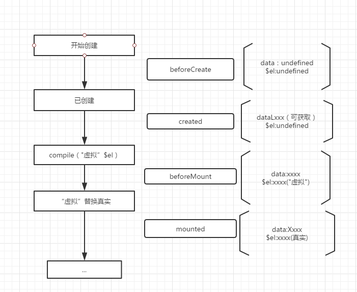
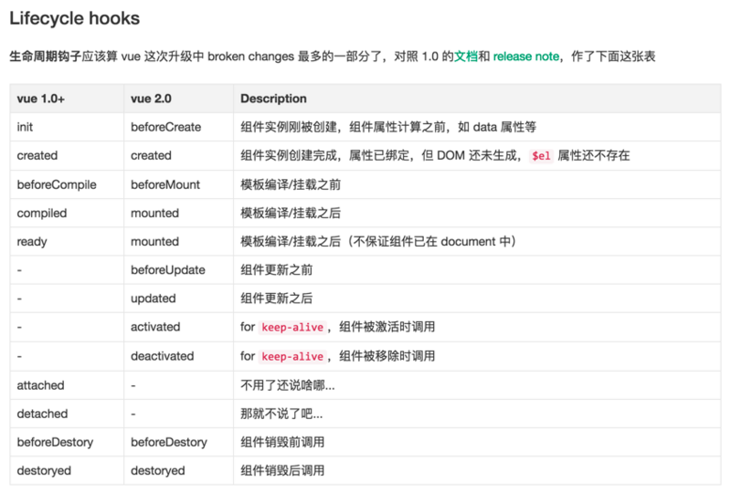

# Vue 常考基础知识点

## 生命周期钩子函数






## 组件通信

组件通信一般分为以下几种情况：

- 父子组件通信
- 兄弟组件通信
- 跨多层级组件通信

### 任意组件

这种方式可以通过 Vuex 或者 Event Bus 解决，另外如果你不怕麻烦的话，可以使用这种方式解决所有的通信情况

```js
bus.$emit('id-selected', 1)   // 派发事件和数据
bus.$on('id-selected', function (id) {  // 监听事件，并在回调函数中，接受传来的数据。})
```

### 父子通信

常用: 父组件通过 `props` 传递数据给子组件，子组件通过 `emit` 发送事件传递数据给父组件,父组件监听事件。

这种父子通信方式也就是典型的单向数据流，父组件通过 `props` 传递数据，子组件不能直接修改 `props`， 而是必须通过发送事件的方式告知父组件修改数据。


另外这两种方式还可以使用语法糖 `v-model` 来直接实现，因为 `v-model` 默认会解析成名为 `value` 的 `prop` 和名为 `input` 的事件。这种语法糖的方式是典型的双向绑定，常用于 UI 控件上，但是究其根本，还是通过事件的方法让父组件修改数据。

当然我们还可以通过访问 `$parent` 或者 `$children` 对象来访问组件实例中的方法和数据。

另外如果你使用 Vue 2.3 及以上版本的话还可以使用 `$listeners` 和 `.sync` 这两个属性。

`$listeners` 属性会将父组件中的 (不含 `.native` 修饰器的) `v-on` 事件监听器传递给子组件，子组件可以通过访问 `$listeners` 来自定义监听器。

`.sync` 属性是个语法糖，可以很简单的实现子组件与父组件通信

```html
<!--父组件中-->
<input :value.sync="value" />
<!--以上写法等同于-->
<input :value="value" @update:value="v => value = v"></comp>

<!--子组件中-->
<script>
  this.$emit('update:value', 1)
</script>
```

### 兄弟组件通信

- 对于这种情况可以通过查找父组件中的子组件实现，也就是 `this.$parent.$children`，在 `$children` 中可以通过组件 `name` 查询到需要的组件实例，然后进行通信。

- 子 =>父 父=>子（在父组件那里周转一下）
-  Event Bus

### 跨多层次组件通信

对于这种情况可以使用 Vue 2.2 新增的 API `provide / inject`，虽然文档中不推荐直接使用在业务中，但是如果用得好的话还是很有用的。

假设有父组件 A，然后有一个跨多层级的子组件 B

```js
// 父组件 A
export default {
  provide: {
    data: 1
  }
}
// 子组件 B
export default {
  inject: ['data'],
  mounted() {
    // 无论跨几层都能获得父组件的 data 属性
    console.log(this.data) // => 1
  }
}
```


## extend 能做什么

这个 API 很少用到，作用是扩展组件生成一个构造器，通常会与 `$mount` 一起使用。

```js
// 创建组件构造器
let Component = Vue.extend({
  template: '<div>test</div>'
})
// 挂载到 #app 上
new Component().$mount('#app')
// 除了上面的方式，还可以用来扩展已有的组件
let SuperComponent = Vue.extend(Component)
new SuperComponent({
    created() {
        console.log(1)
    }
})
new SuperComponent().$mount('#app')
```

## mixin 和 mixins 区别

`mixin` 用于全局混入，会影响到每个组件实例，通常插件都是这样做初始化的。

```js
Vue.mixin({
    beforeCreate() {
        // ...逻辑
        // 这种方式会影响到每个组件的 beforeCreate 钩子函数
    }
})
```

虽然文档不建议我们在应用中直接使用 `mixin`，但是如果不滥用的话也是很有帮助的，比如可以全局混入封装好的 `ajax` 或者一些工具函数等等。

`mixins` 应该是我们最常使用的扩展组件的方式了。如果多个组件中有相同的业务逻辑，就可以将这些逻辑剥离出来，通过 `mixins` 混入代码，比如上拉下拉加载数据这种逻辑等等。

另外需要注意的是 `mixins` 混入的钩子函数会先于组件内的钩子函数执行，并且在遇到同名选项的时候也会有选择性的进行合并，具体可以阅读 [文档](https://cn.vuejs.org/v2/guide/mixins.html)。

## computed 和 watch 区别

`computed` 是计算属性，依赖其他属性计算值，并且 `computed` 的值有缓存，只有相关依赖发生改变时才会重新取值

`watch` 监听到值的变化就会执行回调，在回调中可以进行一些逻辑操作。

所以一般来说需要依赖别的属性来动态获得值的时候可以使用 `computed`，对于监听到值的变化需要做一些复杂业务逻辑的情况可以使用 `watch`。

另外 `computed` 和 `watch` 还都支持对象的写法，这种方式知道的人并不多。

```js
vm.$watch('obj', {
    // 深度遍历
    deep: true,
    // 立即触发
    immediate: true,
    // 执行的函数
    handler: function(val, oldVal) {}
})
var vm = new Vue({
  data: { a: 1 },
  computed: {
    aPlus: {
      // this.aPlus 时触发
      get: function () {
        return this.a + 1
      },
      // this.aPlus = 1 时触发
      set: function (v) {
        this.a = v - 1
      }
    }
  }
})
```

## keep-alive 组件有什么作用

如果你需要在组件切换的时候，保存一些组件的状态防止多次渲染，就可以使用 `keep-alive` 组件包裹需要保存的组件。

对于 `keep-alive` 组件来说，它拥有两个独有的生命周期钩子函数，分别为 `activated` 和 `deactivated` 。用 `keep-alive` 包裹的组件在切换时不会进行销毁，而是缓存到内存中并执行 `deactivated` 钩子函数，命中缓存渲染后会执行 `actived` 钩子函数。

## v-show 与 v-if 区别

`v-show` 只是在 `display: none` 和 `display: block` 之间切换。无论初始条件是什么都会被渲染出来，后面只需要切换 CSS，DOM 还是一直保留着的。所以总的来说 `v-show` 在初始渲染时有更高的开销，但是切换开销很小，更适合于频繁切换的场景。

`v-if` 的话就得说到 Vue 底层的编译了。当属性初始为 `false` 时，组件就不会被渲染，直到条件为 `true`，并且切换条件时会触发销毁/挂载组件，所以总的来说在切换时开销更高，更适合不经常切换的场景。

并且基于 `v-if` 的这种惰性渲染机制，可以在必要的时候才去渲染组件，减少整个页面的初始渲染开销。

## 组件中 data 什么时候可以使用对象

这道题目其实更多考的是 JS 功底。

组件复用时所有组件实例都会共享 `data`，如果 `data` 是对象的话，就会造成一个组件修改 `data` 以后会影响到其他所有组件，所以需要将 `data` 写成函数，每次用到就调用一次函数获得新的数据。

当我们使用 `new Vue()` 的方式的时候，无论我们将 `data` 设置为对象还是函数都是可以的，因为 `new Vue()` 的方式是生成一个根组件，该组件不会复用，也就不存在共享 `data` 的情况了。

