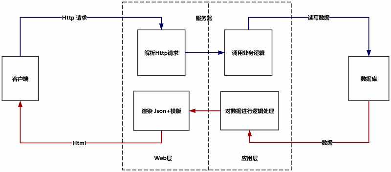
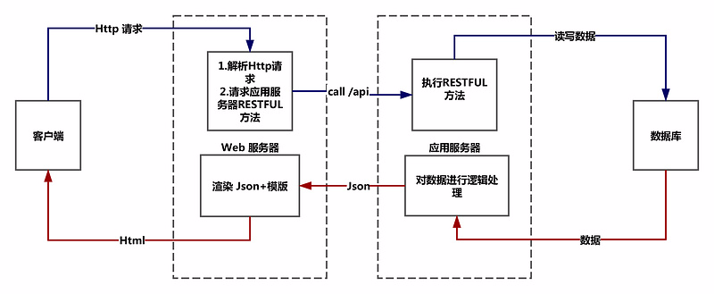
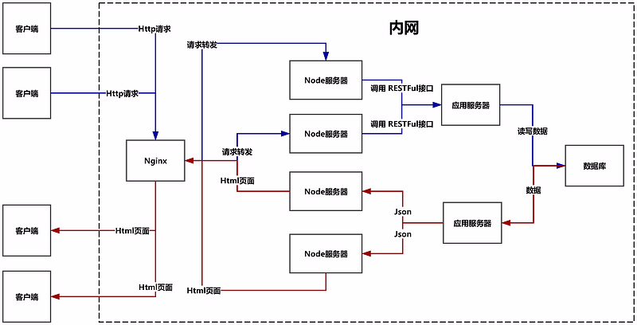
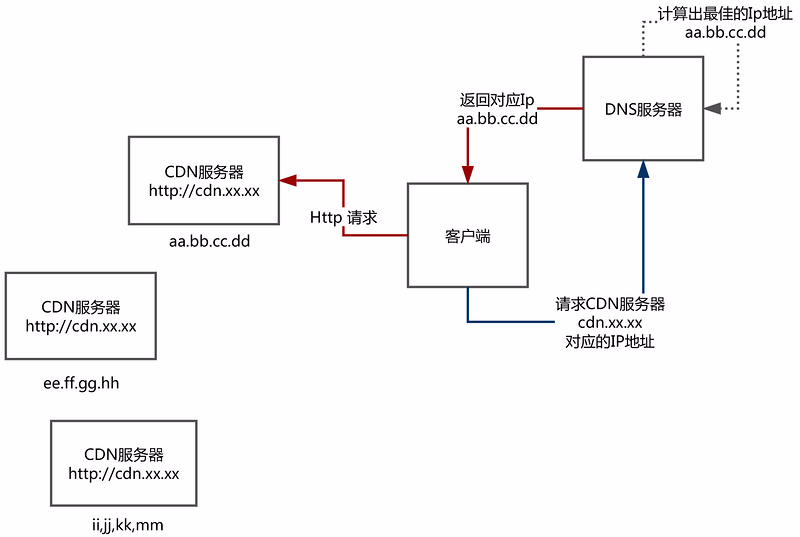

### **前言**

客户端－服务器的通信会经历如下几个阶段:

1. 客户端输入URL
2. DNS服务器解析URL阶段（域名--IP地址）
3. Web服务器解析Http请求阶段（存放资源）
4. 应用服务器逻辑处理阶段（GGI程序，比如PHP）
5. 数据库操作阶段
6. Web服务器模版渲染阶段
7. Web服务器将Html返回给客户端

### 解析URL

当客户在浏览器输入某个URL, 首先会经历域名解析阶段，即向DNS服务器解析目标URL返回对应目标URL的Ip地址，再根据这个目标Ip地址请起对应的服务器.比如在浏览器中输入[www.xx.yy.com](http://www.xx.yy.com/)后，

1. 浏览器在本地缓存查找[www.xx.yy.com对应的IP](http://www.xx.yy.com对应的ip/)，如果没找到
2. 向DNS服务器请求[www.xx.yy.com对应的IP,如果DNS](http://www.xx.yy.com对应的ip,如果dns/)服务器解析不出来
3. 向更上一级DNS服务器请求[www.xx.yy.com对应的IP,如果DNS](http://www.xx.yy.com对应的ip,如果dns/)服务器解析不出来
4. 向更上一级DNS服务器请求[www.xx.yy.com对应的IP,直到给客户端返回对应的IP(192.0.0.1](http://www.xx.yy.com对应的ip,直到给客户端返回对应的ip(192.0.0.1/))
5. 浏览器向[www.xx.yy.com对应的IP地址发送Http请求(192.0.0.1](http://www.xx.yy.com对应的ip地址发送http请求(192.0.0.1/))

### 客户端－(web+应用)服务器－数据库

- 浏览器向服务器发起Http请求

- 服务器中的web服务层能够处理Http请求

- 服务器中的应用层部分能够调用业务逻辑，调用业务逻辑上的方法

- 如果有必要，服务器会和数据库进行数据交换. 然后将模版＋数据渲染成最终的Html, 返送给客户端

此时是前端写好页面，交给后端，后端渲染的模式，前后端不分离。当客户端请求时拿到的每次都是渲染好的页面。

------

### 客户端－web服务器－应用服务器－数据库

类似模型1，只是将web服务和应用服务解耦

- 客户端向web服务器发起Http请求

- web服务能够处理Http请求，并且调用应用服务器暴露在外的RESTFUL接口

- 应用服务器的RESTFUL接口被调用，会执行对应的暴露方法.如果有必要和数据库进行数据交互，应用服务器会和数据库进行交互后，将json数据返回给**web服务器**

- web服务器将模版＋数据组合渲染成html返回给客户端

此时，前后端分离，数据通过接口拿到，此时客户端请求拿到的是动态的前端页面，页面加载后再通过接口拿到数据渲染，相比第一种，这种开发更方便，渲染需要时间。

------

### 客户端－负载均衡器(Nginx)－中间服务器(Node)－应用服务器－数据库

1. 整正暴露在外的不是真正web服务器的地址，而是负载均衡器器（Nginx）的地址
2. 客户向负载均衡器（Nginx）发起Http请求
3. 负载均衡器（Nginx）能够将客户端的Http请求均匀的转发给Node服务器集群
4. Node服务器接收到Http请求之后，能够对其进行解析，并且能够调用应用服务器(处理程序)暴露在外的RESTFUL接口
5. 应用服务器的RESTFUL接口被调用，会执行对应的暴露方法.如果有必要和数据库进行数据交互，应用服务器会和数据库进行交互后，将json数据返回给Node
6. Node层将模版＋数据组合渲染成html返回反向代理服务器
7. 反向代理服务器（Nginx）将对应html返回给客户端

##### **注意**

1. 首先来明晰一下Nginx概念. Nginx的优点有: **作为反向代理能够起到负载均衡的作用**, 负载均衡就是能够承受、高并发的大量的请求，然后将这些请求均匀的转发给内部的服务器，分摊压力. 并且**反向代理能够解决跨域引起的问题**，因为Nginx，Node,应用服务器，数据库都在内网段呀. 并且，**Nginx非常擅长处理静态资源(img,css,js,video)，所以也经常作为静态资源服务器，也叫做CDN**
2. 特别的，前一个用户访问index.html, 经过Nginx－Node－应用服务器－数据库链路之后，Nginx会把index.html返回给用户，并且会把index.html缓存在Nginx上
3. 下一个用户再想请求index.html的时候，请求Nginx服务器，Nginx发现有index.html的缓存，于是就不用去请求Node层了，会直接将缓存的页面(如果没过期的话)返回给用户.

------

### 客户端 - (静态资源服务器CDN,负载均衡服务器Nginx)-中间服务器(Node)－应用服务器－数据库

1. 客户端的**静态请求**(images,css,js等)全部走CDN
2. 客户端的**动态请求**(html页面上的数据需要从数据库中取，而且需要逻辑处理)就走负载均衡器Nginx(反向代理)

1. 客户端拿到的index.html如下:
21

1. 客户端开始解析index.html, 发现了img标签，于是得向cdn.xx.xx请求1.png
2. 客户端想得到cdn.xx.xx这个域名的IP, 于是查找本地DNS缓存
3. 如果没有缓存，于是向最低层DNS服务器发起域名解析，期望得到cdn.xx.xx对应的IP
4. DNS服务器收到请求，发现用户的Http-header里请求的是cdn.xx.xx，请求的是一个CDN服务器(其实是一个分散的集群)的IP地址. 于是DNS会动态计算，这个域名对应的CDN服务器集群，哪一台服务器离用户更近更快更合适
5. DNS服务器计算出最合适的CDN服务器IP之后，将该IP返回给客户端
6. 客户端向这个IP请求静态资源.

##### **注意:**

**为什么CDN服务能够极大地提高用户请求静态资源的效率?**

就是因为你请求的CDN服务器URL对应的IP是经过了DNS服务器的计算得出的最优解. 当DNS服务器收到用户的域名解析请求的时候，如果发现用户请求的是CDN服务器集群的域名，那么DNS会根据用户所在IP地址计算，找到离用户最近的／网络状况最好的 CDN服务器对应的IP地址，返回给客户端.

其实，这和异地多机房部署是一个原理 

很多大公司服务器一般会分南北两个集群. 比如一个集群在广州，一个集群在北京. 那么当用户访问该公司的URL的时候，首先肯定会向DNS服务器请求该URL Hostname对应的IP地址. DNS服务器会根据该用户的IP，来判断到底是返回广州地区服务器的IP，还是北京地区服务器的IP 

如果用户当前的IP段是在天津，DNS就会将北京服务器的IP地址返回给客户. 如果用户当前IP段在深圳，DNS服务器就会返回深圳服务器的IP给用户. 这样极大的提高了服务器的响应速度(试想一下如果你在北京，你家对面就是该公司北京服务器的机房.但你发现自己的请求却最终被发到了广州机房，这是多么蛋疼的一件事情) 

并且，不仅仅是提高服务器的响应效率，多机房部署对于容灾等等也是必要的（万一广州的机房失火了断电了，公司可以去配置DNS服务器，不管用户在那个IP段，都返回北京机房的IP地址,这样就整个南方片区的请求只是变慢了而已，不至于全部瘫痪)

